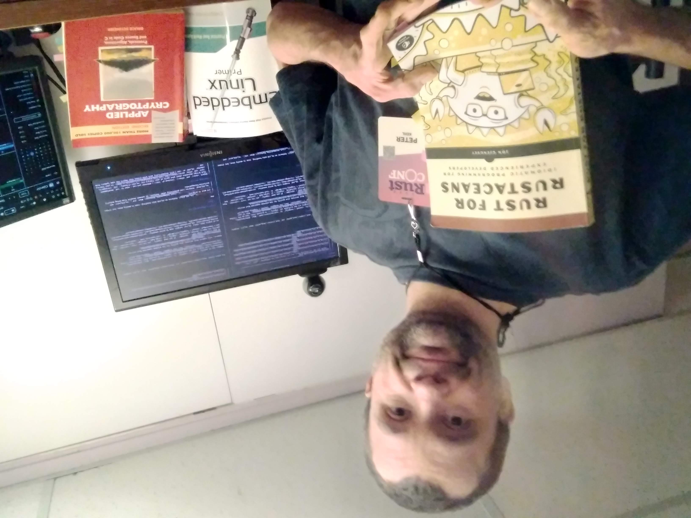

# I love Rust

## Why Rust

While I've worked in several programming languages, but Rust. It makes memory and concurrency safe.
It is explicit and any side effects are controlled. Types are pretty good. Also, I love the
community of Rustaceans.

## Current projects

As of winter 2022/2023, I'm working on these Rust crates:

- smart slices ([ranging-rs/slicing-rs](https://github.com/ranging-rs/slicing-rs)).
- smart ranges ([ranging-rs/ranging-rs](https://github.com/ranging-rs/ranging-rs)),
- heap and heapless functionality ([ranging-rs/heappie](https://github.com/ranging-rs/heappie)),
- patterns on handling data in `no_std` (embedded-friendly) Rust
  [peter-kehl/no_std_data](https://github.com/peter-kehl/no_std_data),
- cooperative allocation ([coop-rs/coop](https://github.com/coop-rs)).

## Presentations

- [no_std libraries in Rust](https://peter-kehl.github.io/no_std_libs),
- Present Markdown with Reveal.js (on GitHub Pages)
  [present_markdown_reveal](https://peter-kehl.github.io/present_markdown_reveal.js/),
- `peter-kehl/no_std_rna_slice_patterns_presentation` (I'll move it into its related project
  [peter-kehl/no_std_data](https://github.com/peter-kehl/no_std_data)),
- a few more are work in progress.
<!-- [Why declare incompatible `features` in Rust libraries?](https://peter-kehl.github.io/rust_incompatible_features) -->
<!-- https://peter-kehl.github.io/no_std_data/ -->

## Contributing

I'm open to long-term contracting and permanent positions. Extra points if it's open source.
